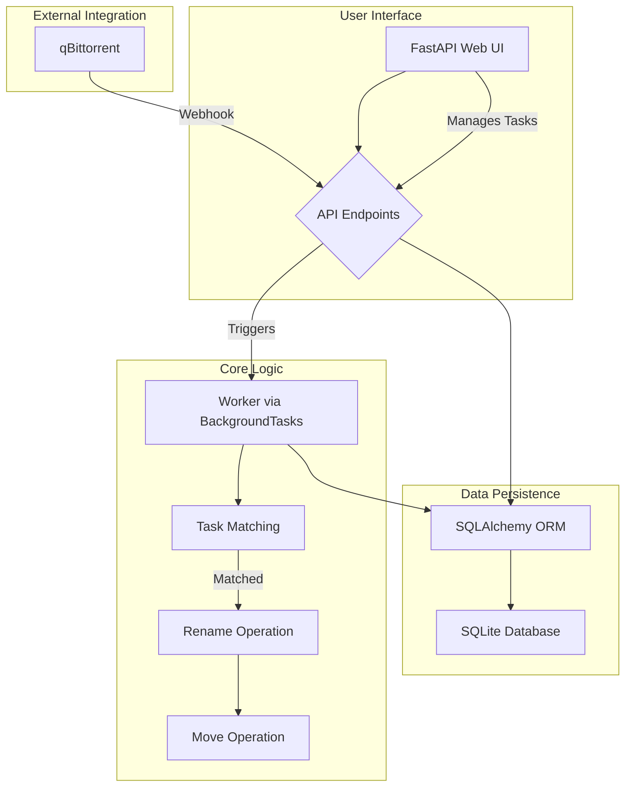
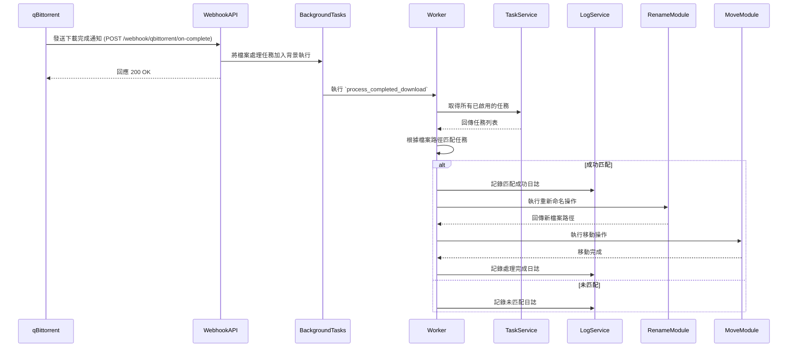

# Movera 專案規格

## 1. 專案架構

Movera 是一個自動化檔案處理工具，核心功能是接收 qBittorrent 下載完成時發送的 Webhook 通知，並根據使用者定義的規則，對下載完成的檔案進行重新命名和移動。

### 1.1. 整體架構圖



### 1.2. 目錄結構

```
.
├── api/                  # FastAPI 應用程式
│   ├── middlewares/      # 中介軟體
│   └── routers/          # API 路由
├── app/                  # 核心商業邏輯
│   ├── modules/          # 功能模組 (move, rename)
│   └── worker.py         # 檔案處理背景工作
├── core/                 # 核心元件
│   ├── database.py       # 資料庫連線與設定
│   ├── models/           # SQLAlchemy ORM 模型
│   ├── repositories/     # 資料庫操作封裝
│   ├── schemas/          # Pydantic 資料驗證模型
│   └── services/         # 商業邏輯服務
├── migration/            # Alembic 資料庫遷移
└── tests/                # 測試程式碼
```

### 1.3. 技術堆疊

| 類別 | 技術 | 用途 |
| --- | --- | --- |
| Web 框架 | FastAPI | 提供 RESTful API |
| 資料庫 | SQLite | 儲存任務與日誌 |
| ORM | SQLAlchemy | 資料庫操作 |
| 資料驗證 | Pydantic | API 請求/回應的資料驗證與序列化 |
| 背景任務 | FastAPI BackgroundTasks | 處理非同步的檔案操作 |
| API 文件 | Swagger UI / ReDoc | 自動產生 API 文件 |
| 資料庫遷移 | Alembic | 管理資料庫結構變更 |

## 2. 撰寫風格

- **Python**:
    - 遵循 [PEP 8](https://www.python.org/dev/peps/pep-0008/) 風格指南。
    - 使用 Type Hint 進行型別註記，提升程式碼可讀性與可維護性。
    - 函式與類別皆有 Docstring 說明其用途、參數與回傳值。
- **API**:
    - 遵循 RESTful 設計原則。
    - 使用 Pydantic 進行嚴格的資料驗證。
    - API 端點提供詳細的 `summary` 和 `response_description`，以利自動產生文件。

## 3. API 架構

### 3.1. API 設計原則

- **資源導向**: API 以資源 (Tasks, Logs) 為中心進行設計。
- **標準 HTTP 方法**:
    - `GET`: 讀取資源。
    - `POST`: 建立新資源。
    - `PUT`: 更新現有資源。
    - `DELETE`: 刪除資源。
- **清晰的 URL 結構**: `/api/v1/{resource}/{resource_id}`
- **一致的回應格式**:
    - 成功: `200 OK`, `201 Created`, `204 No Content`。
    - 失敗: `400 Bad Request`, `404 Not Found`, `500 Internal Server Error`，並附帶詳細的錯誤訊息。

### 3.2. API 端點

#### Tasks API (`/api/v1/tasks`)

- `GET /tasks`: 獲取所有任務。
- `POST /task`: 建立一個新任務。
- `PUT /task/{task_id}`: 更新指定任務。
- `DELETE /task/{task_id}`: 刪除指定任務。
- `GET /tasks/stats`: 獲取任務統計數據。

#### Logs API (`/api/v1/log`)

- `GET /log/{task_id}`: 獲取指定任務的所有日誌。
- `POST /log`: 建立一個新的日誌項目。

#### Webhook API (`/webhook`)

- `POST /qbittorrent/on-complete`: 接收 qBittorrent 下載完成的 Webhook 通知。

### 3.3. 資料模型 (Pydantic Schemas)

- **Task**:
    - `id`: UUID (string)
    - `name`: string
    - `include`: string
    - `move_to`: string
    - `src_filename`: Optional[string]
    - `dst_filename`: Optional[string]
    - `rename_rule`: Optional[Literal["regex", "parse"]]
    - `enabled`: bool
    - `created_at`: datetime
- **Log**:
    - `id`: integer
    - `task_id`: string
    - `level`: Literal["DEBUG", "INFO", "WARNING", "ERROR", "CRITICAL"]
    - `message`: string
    - `timestamp`: datetime
- **QBittorrentPayload**:
    - `filepath`: string
    - `category`: Optional[string]
    - `tags`: Optional[string]

## 4. 核心處理流程

