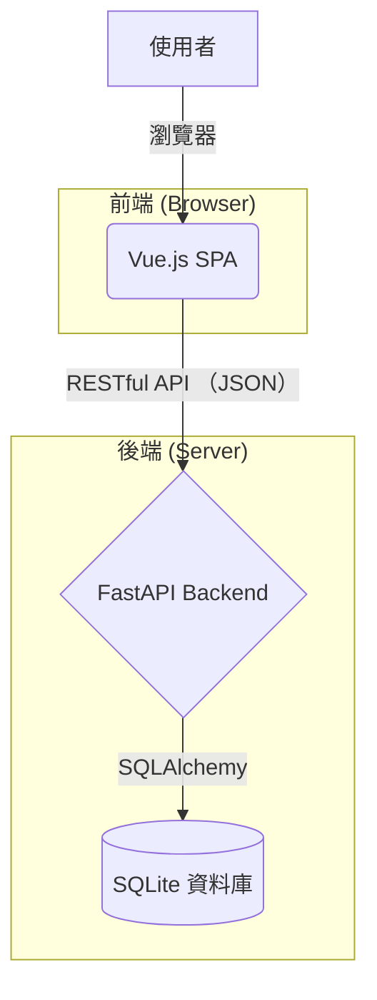
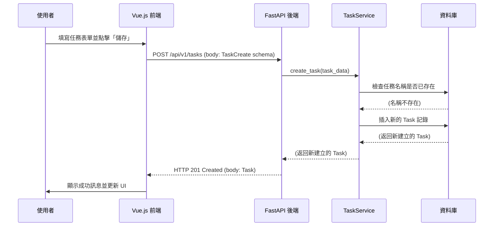

# Movera 技術規格文件

## 1. 專案總覽

Movera 是一個自動化檔案管理系統。其核心功能是允許使用者定義一系列「任務 (Task)」。每個任務包含一組規則，用於監控特定目錄、篩選檔案，並根據預設規則將這些檔案移動到指定位置，可選擇性地進行重新命名。

此系統由一個 Vue.js 前端單頁應用 (SPA) 和一個 FastAPI 後端 API 組成，透過 RESTful API 進行通訊。

## 2. 技術棧 (Tech Stack)

### 2.1. 前端 (Frontend)

- **語言:** TypeScript
- **框架:** Vue 3
- **建置工具:** Vite
- **路由:** Vue Router
- **狀態管理:** Pinia
- **UI/樣式:** Tailwind CSS
- **表單驗證:** VeeValidate + Zod
- **國際化:** vue-i18n

### 2.2. 後端 (Backend)

- **語言:** Python 3.12+
- **框架:** FastAPI
- **非同步伺服器:** Uvicorn
- **ORM:** SQLAlchemy
- **資料庫:** SQLite
- **資料庫遷移:** Alembic
- **套件管理:** uv
- **日誌:** Loguru

### 2.3. 部署 (Deployment)

- **容器化:** Docker (多階段建置)

## 3. 系統架構

系統採用經典的客戶端-伺服器 (Client-Server) 架構。前端是一個獨立的單頁應用，負責使用者介面和互動。後端提供 API 服務，處理所有業務邏輯和資料庫操作。

### 高階架構圖

## 4. 後端設計

後端採用分層架構，主要分為路由層、服務層、倉儲層和模型層。

- **`api/routers/`**: 定義 API 端點，處理 HTTP 請求和響應。
- **`core/services/`**: 封裝核心業務邏輯，由路由層呼叫。
- **`core/repositories/`**: 抽象資料庫操作，提供給服務層使用 (註：此層程式碼未直接讀取，但從服務層推斷存在)。
- **`core/models/`**: 定義 SQLAlchemy 資料庫模型。

### 4.1. 資料模型

- **`Task`**: 核心模型，定義一個檔案處理任務。
  - `id` (String, UUID): 主鍵。
  - `name` (String): 任務名稱，唯一。
  - `include` (String): 要包含的檔案/目錄規則。
  - `move_to` (String): 目標目錄。
  - `rename_rule` (String, nullable): 重新命名規則。
  - `enabled` (Boolean): 是否啟用。
- **`Log`**: 記錄任務執行日誌。
  - `id` (Integer): 主鍵。
  - `task_id` (String): 關聯的 Task ID。
  - `level` (String): 日誌等級 (e.g., INFO, ERROR)。
  - `message` (String): 日誌訊息。
- **`Setting`**: 鍵值對設定表。
  - `key` (String): 設定鍵名，主鍵。
  - `value` (String): 設定值。

### 4.2. API 端點

根據 `api/main.py` 的路由設定，主要端點分佈在以下模組：

- `/api/v1/tasks`: 處理任務的 CRUD 操作。
- `/api/v1/logs`: 獲取指定任務的日誌。
- `/api/v1/settings`: 處理應用程式設定的讀取和更新。
- `/api/v1/health`: 健康檢查端點。
- `/webhook`: 接收外部觸發的 Webhook (推測用途)。

### 請求生命週期圖

以下是一個建立新任務的典型請求流程：

## 5. 前端設計

前端是一個基於 Vite 和 Vue 3 的單頁應用程式 (SPA)。

- **啟動流程 (`main.ts`):** 應用啟動時，會先初始化 Pinia，接著從後端拉取全域設定，然後根據設定初始化 i18n，最後才掛載路由和 Vue 應用。
- **路由 (`router/index.ts`):** 使用 `vue-router` 進行頁面導航，所有主要頁面都使用一個共用的 `Layout.vue`。路由採用懶加載以提升效能。
- **狀態管理 (`stores/`):** 使用 Pinia 進行狀態管理，主要有 `useTaskStore` 和 `useSettingStore`，分別管理任務相關資料和應用程式設定，與後端 API 緊密對應。
- **視圖 (`views/`):** 包含 `TasksListView`、`TaskDetailView`、`CreateTaskView` 等主要頁面元件。

## 6. 資料庫設計

- **資料庫類型:** SQLite。
- **ORM:** SQLAlchemy。
- **遷移管理:** Alembic。遷移腳本位於 `migration/versions/`。開發者應使用 `alembic` 命令來管理資料庫結構的變更。

## 7. 開發與部署

### 7.1. 開發環境

- **後端:** 透過 `uv sync --locked` 安裝依賴，使用 `uv run main.py` 啟動後端伺服器。
- **前端:** 透過 `npm install` 安裝依賴，使用 `npm run dev` 啟動 Vite 開發伺服器。

### 7.2. 部署

專案透過一個多階段 `Dockerfile` 進行容器化部署。

1.  **Builder 階段:** 使用 Node.js 環境建置前端靜態檔案。
2.  **Final 階段:** 使用輕量級的 Python 環境，複製後端程式碼和第一階段產出的前端靜態檔案，安裝 Python 依賴，並啟動 FastAPI 伺服器。

最終容器會將前端靜態檔案與後端 API 整合在一起提供服務。
